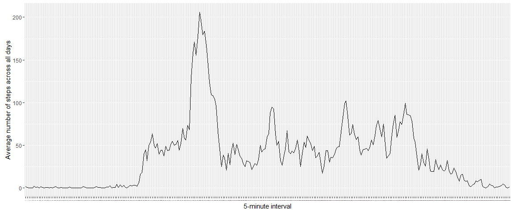

# Reproducible Research: Peer Assessment 1


## Loading and preprocessing the data
Data is loaded into a R variable called `act_data`:


```r
setwd("/users/Mark/Documents/R/RepData_PeerAssessment1")
act_data <- read.csv('./activity.csv')
```

Conversion to correct format in R:


```r
act_data$date <- as.Date(act_data$date)
act_data$interval <- as.factor(act_data$interval)
```

`act_data` has the following variables of the following classes:


```r
names(act_data)
```

```
## [1] "steps"    "date"     "interval"
```

```r
lapply(act_data, class)
```

```
## $steps
## [1] "integer"
## 
## $date
## [1] "Date"
## 
## $interval
## [1] "factor"
```


## What is mean total number of steps taken per day?
To show a graphicical representaton, let's make a histogram.

Let's sum the number of steps per each day and remove the missing data (shown as `NA`):


```r
library(plyr)
```

```
## Warning: package 'plyr' was built under R version 3.2.3
```

```r
quest_2 <- ddply(act_data[,1:2], .(date), function(set) { sum(set$steps, na.rm = TRUE) })
```

`plot_data`'s variables are renamed to be friendlier:


```r
names(quest_2) <- c("date", "steps")
```

The historgram is generated:


```r
library(ggplot2)
```

```
## Warning: package 'ggplot2' was built under R version 3.2.3
```

```r
ggplot(data = quest_2) + aes(x = factor(date), y = steps) + geom_bar(stat = "identity") + labs(x ="Date", y = "Total number of steps") + theme(axis.text.x=element_text(angle = -90, hjust = 0))
```

\

The average and median number of total steps taken per day are:


```r
mean(quest_2$steps)
```

```
## [1] 9354.23
```

```r
median(quest_2$steps)
```

```
## [1] 10395
```

```r
# What is the average daily activity pattern?

# Let's produce  a time series plot for the average total number of steps taken for each day.

# First calculate the mean for the number of steps for each day and removing any missing values (coded as `NA`)
```

```r
quest3_data <- ddply(act_data, .(interval), function(set) { mean(set$steps, na.rm = TRUE) })
```

`plot_data`'s variables are renamed to be friendlier:


```r
names(quest3_data) <- c("interval", "steps")
```

The time series chart is generated:


```r
hour_intervals <- c(12, 24, 36, 48, 60, 72, 84, 96, 108, 120, 132, 144, 156, 168, 180, 192, 204, 216, 228, 240, 252, 264, 276)
ggplot(data = quest3_data) + aes(x = factor(interval), y = steps, group = 1) + geom_line() + labs(x ="5-minute interval", y = "Average number of steps across all days") + theme(axis.text.x = element_text(size = 0)) 
```

\

Each interval represents an hour. 

The interval with the maximum number of steps is calculated as follows:


```r
quest3_data[quest3_data$steps == max(quest3_data$steps), ]$interval
```

```
## [1] 835
## 288 Levels: 0 5 10 15 20 25 30 35 40 45 50 55 100 105 110 115 120 ... 2355
```

## Imputing missing values
There are 2304 missing values for the `steps` variable (coded as `NA`) in `activity_data`:


```r
nrow(act_data[is.na(act_data$steps), ])
```

```
## [1] 2304
```

Let's produce a histogram for the total number of steps taken each day with missing values (coded `NA`) *imputed*. Missing values will be imputed by calculating the average number of steps for that interval across all days.

The function that will be used to impute looks as follows:

```r
input_mean <- function(x) {
  replace(x, is.na(x), mean(x, na.rm = TRUE))
}
```

An `order` variable, representing the row order, is added to `act_data` so that the data frame with the imputed values can be sorted according to the original order:


```r
act_data$order <- 1:nrow(act_data)
```

`NA` values are imputed by taking the mean of the total steps for that interval across all days. The resulting dataset is stored in `input_activity_data`:


```r
input_activity_data <- ddply(act_data, .(interval), transform, steps = input_mean(steps))
```

`input_activity_data` is ordered so that it reflects the original order of `act_data`:


```r
input_activity_data <- input_activity_data[order(input_activity_data$order), ]
```

`input_activity_data` has the following variables of the following classes:


```r
names(act_data)
```

```
## [1] "steps"    "date"     "interval" "order"
```

```r
lapply(act_data, class)
```

```
## $steps
## [1] "integer"
## 
## $date
## [1] "Date"
## 
## $interval
## [1] "factor"
## 
## $order
## [1] "integer"
```

Now that missing values have been imputed, we can create the histogram.


```r
quest4_data <- ddply(input_activity_data[,1:2], .(date), function(set) { sum(set$steps, na.rm = TRUE) })
```

`plot_data`'s variables are renamed to be easier to understand.


```r
names(quest4_data) <- c("date", "steps")
```

The historgram is generated:


```r
ggplot(data = quest4_data) + aes(x = factor(date), y = steps) + geom_bar(stat = "identity") + labs(x ="Date", y = "Total number of steps (NA Input)") + theme(axis.text.x=element_text(angle = -90, hjust = 0))
```

\

The average and median number of total steps taken per day, with missing values imputed, are:


```r
mean(quest4_data$steps)
```

```
## [1] 10766.19
```

```r
median(quest4_data$steps)
```

```
## [1] 10766.19
```

The following table compares the values for `steps` where missing are present and where missing values have been input:

|             | With missing values                                   | Missing values imputed                                |
| ---         | ---                                                   |---                                                    | 
| **Mean**    | 9354   | 10766   |
| **Median**  | 10395 | 10766 |

The following observations are made:

* When the missing values are imputed, the mean and median are higher.
* For the case where missing values are imputed, the mean and median are equal. 

## Are there differences in activity patterns between weekdays and weekends?

To analyse activity patterns between weekdays and weekends, a vector is created with the weekday for each value of `date` in `input_activity_data`. A factor variable, `which_day`, is then added to `input_activity_data` indicating whether the date is on a weekday or a weekend


```r
which_day <- weekdays(input_activity_data$date)
input_activity_data$which_day <- ifelse(which_day == "Saturday" | which_day == "Sunday" , c("weekend"), c("weekday"))
input_activity_data$which_day <- factor(input_activity_data$which_day)
```

`input_activity_data` now has the following variables of the following classes:


```r
names(input_activity_data)
```

```
## [1] "steps"     "date"      "interval"  "order"     "which_day"
```

```r
lapply(input_activity_data, class)
```

```
## $steps
## [1] "numeric"
## 
## $date
## [1] "Date"
## 
## $interval
## [1] "factor"
## 
## $order
## [1] "integer"
## 
## $which_day
## [1] "factor"
```

Two time series plots will be produced:

* The average total number of steps taken for each interval across weekdays.
* The average total number of steps taken for each interval across weekends.

The data for the first plot is prepared by calculting the mean for the number of steps for each interval observed over **weekdays**:


```r
quest5_weekdays <- ddply(input_activity_data[input_activity_data$which_day == "weekday", ], .(interval), function(set) { mean(set$steps, na.rm = TRUE) })
```

`quest5_weekdays`'s variables are renamed to be friendlier:


```r
names(quest5_weekdays) <- c("interval", "steps")
```

The data for the second plot is prepared by calculting the mean for the number of steps for each interval observed over **weekdends**:


```r
quest5_weekends <- ddply(input_activity_data[input_activity_data$which_day == "weekend", ], .(interval), function(set) { mean(set$steps, na.rm = TRUE) })
```

`quest5_weekdays`'s variables are renamed to be friendlier:


```r
names(quest5_weekends) <- c("interval", "steps")
```

Both time series chart objects are generated:


```r
plot_weekdays <- ggplot(data = quest5_weekdays) + aes(x = factor(interval), y = steps, group = 1) + geom_line() + labs(x ="5-minute interval", y = "Average number of steps across weekdays") + theme(axis.text.x = element_text(size = 0)) + geom_vline(xintercept= hour_intervals, linetype="dotted") + geom_vline(xintercept= 144, colour = "red") + geom_text(x=144, y = 150, label="12 pm", angle = 90)

plot_weekends <- ggplot(data = quest5_weekends) + aes(x = factor(interval), y = steps, group = 1) + geom_line() + labs(x ="5-minute interval", y = "Average number of steps across weekends") + theme(axis.text.x = element_text(size = 0)) + geom_vline(xintercept= hour_intervals, linetype="dotted") + geom_vline(xintercept= 144, colour = "red") + geom_text(x=144, y = 150, label="12 pm", angle = 90)
```

A function (taken from the R Cookbook at http://www.cookbook-r.com/Graphs/Multiple_graphs_on_one_page_(ggplot2)) is defined to render both plots:


```r
multiplot <- function(..., plotlist=NULL, cols) {
  require(grid)
  
  # Make a list from the ... arguments and plotlist
  plots <- c(list(...), plotlist)
  
  numPlots = length(plots)
  
  # Make the panel
  plotCols = cols                          # Number of columns of plots
  plotRows = ceiling(numPlots/plotCols) # Number of rows needed, calculated from # of cols
  
  # Set up the page
  grid.newpage()
  pushViewport(viewport(layout = grid.layout(plotRows, plotCols)))
  vplayout <- function(x, y)
    viewport(layout.pos.row = x, layout.pos.col = y)
  
  # Make each plot, in the correct location
  for (i in 1:numPlots) {
    curRow = ceiling(i/plotCols)
    curCol = (i-1) %% plotCols + 1
    print(plots[[i]], vp = vplayout(curRow, curCol ))
  }
  
}
```

The plots are then generated using this function:


```r
multiplot(plot_weekdays, plot_weekends, cols = 1)
```

```
## Loading required package: grid
```

\

The following observations are made:

* By comparing the top chart (weekdays) to the bottom chart (weekends) it appears that activity averages higher on the weekends than the weekdays (~75 vs. 50)
